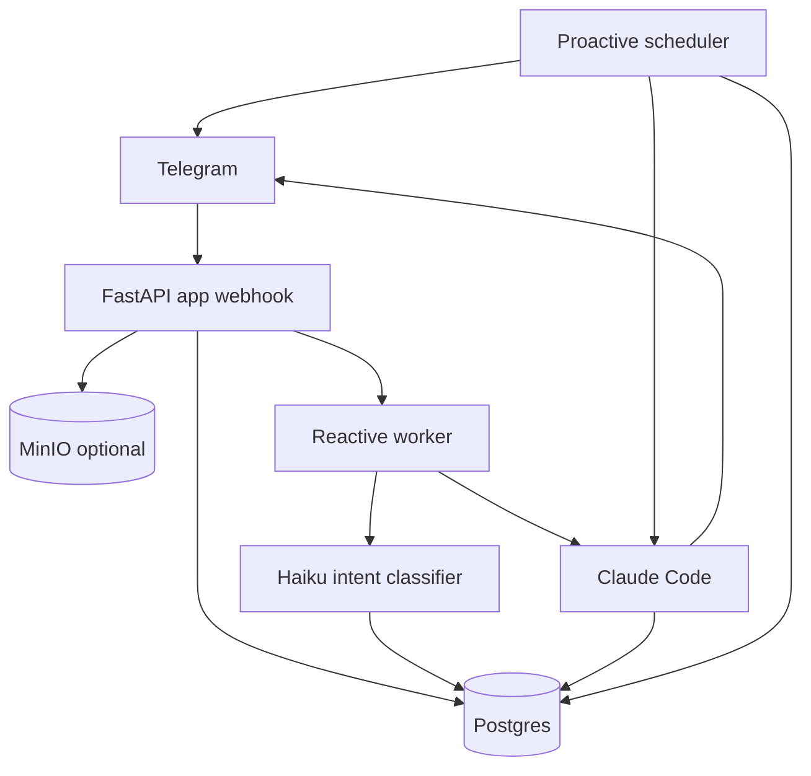

# AGI One-Prompt Build Spec (Server-Agent vNext)

This document is a **technical specification** for assembling an AGI-style server agent from **a single prompt**: infrastructure, storage, reactive + proactive loops, prompt pack, and self-update pipeline.

## 0) Objectives (what must exist immediately)

### 0.1 Core goals
1. **Persistence-first**: a database container exists from day 0; the agent can read/write it.
2. **Reactive loop is the primary UX**: Telegram webhook ingests messages, stores them, triggers processing.
3. **Context coherence**: for each interaction, the agent receives the **last 30 messages** (with timestamps) and relevant derived artifacts (voice transcription, image-to-JSON).
4. **Low-latency acknowledgement**: a small model (Haiku) classifies intent and returns a 1-sentence plan/understanding + an **inline OK button**.
5. **Token policy**:
   - Proactive loop is token-budgeted to **7,000,000 tokens/day**.
   - Reactive loop is **not token-limited**.
6. **Self-update**: repository is on the server; changes are developed in a branch; merge to main triggers build/test/redeploy with rollback + report to Master (also stored in DB).

### 0.2 Non-goals (explicitly out of scope)
- Multi-tenant user management, payments, or complex RBAC in first iteration.
- Distributed multi-server orchestration (later).

---

## 1) System overview

### 1.1 Components
- **app**: Python service (FastAPI) providing:
  - Telegram webhook endpoint
  - Reactive worker
  - Proactive scheduler
  - Admin/health endpoints
- **postgres**: structured persistence:
  - dialogs
  - tasks/projects
  - token accounting
  - deployments and reports
- **minio** (optional but recommended): object storage for:
  - original media (voice, images, docs)
  - derived artifacts (transcripts, OCR JSON)
- **worker queue**: minimal approach first:
  - use Postgres table as a queue OR Redis (optional) OR simple in-process async queue.

### 1.2 Deployment topology

---

## 2) Container architecture

### 2.1 docker-compose baseline
- `app` container runs FastAPI + workers.
- `postgres` container runs Postgres 16.
- Optional `minio` container.

**Networking**: all internal; only webhook port is publicly exposed.

**Secrets**:
- Use `.env` for non-secret config.
- Use `.env.secrets` (600 perms) for secrets OR docker secrets.

### 2.2 Environment variables
Required (examples):
- `DATABASE_URL`
- `TELEGRAM_BOT_TOKEN`
- `TELEGRAM_WEBHOOK_SECRET`
- `MASTER_CHAT_IDS`
- `CLAUDE_CODE_OAUTH_TOKEN`
- `HAIKU_API_KEY` (or same provider key if unified)

Optional:
- `MINIO_ENDPOINT`, `MINIO_ACCESS_KEY`, `MINIO_SECRET_KEY`, `MINIO_BUCKET`

---

## 3) Database design

### 3.1 Core tables (minimum)

#### `chat_threads`
- `id` (pk)
- `platform` (telegram)
- `chat_id` (telegram chat id)
- `created_at`, `updated_at`
- unique(platform, chat_id)

#### `chat_messages`
Stores every dialog turn.
- `id` (pk)
- `thread_id` (fk chat_threads)
- `platform_message_id` (telegram message_id)
- `role` (user|assistant|system)
- `author_user_id` (telegram user id)
- `text`
- `created_at` (ts)
- `raw_payload` (jsonb)  
- indexes: (thread_id, created_at desc)

#### `message_artifacts`
Derived and attached artifacts.
- `id` (pk)
- `message_id` (fk chat_messages)
- `kind` (voice_transcript|image_json|ocr_text|file_meta|tool_result)
- `content_json` (jsonb)
- `uri` (optional: s3/minio path)
- `created_at`

#### `reactive_jobs`
Queue of jobs triggered by webhook.
- `id` (pk)
- `thread_id` (fk)
- `trigger_message_id` (fk chat_messages)
- `status` (queued|running|done|failed|canceled)
- `mode` (classify|plan|execute|answer)
- `payload_json` (jsonb)
- `created_at`, `started_at`, `finished_at`

#### `approvals`
State for inline OK confirmation.
- `id` (pk)
- `thread_id` (fk)
- `job_id` (fk reactive_jobs)
- `proposal_text` (text)
- `status` (pending|approved|rejected|superseded)
- `created_at`, `resolved_at`

#### `token_ledger`
- `id` (pk)
- `scope` (proactive|reactive)
- `provider` (claude_code|anthropic_api|other)
- `tokens_input`, `tokens_output`, `tokens_total`
- `created_at`
- `meta_json` (jsonb)

#### `deployments`
- `id` (pk)
- `git_sha`, `branch`
- `status` (building|testing|deploying|healthy|rolled_back|failed)
- `started_at`, `finished_at`
- `report_text` (text)

### 3.2 Retention policy
- Keep all messages.
- Artifacts may be stored in MinIO; DB stores pointers and JSON summaries.

---

## 4) Reactive system (Telegram webhook)

### 4.1 Ingestion
1. Webhook receives Telegram update.
2. Normalize into internal message model.
3. Persist:
   - create thread if missing
   - insert message into `chat_messages`
   - store media in MinIO (optional)
   - create `message_artifacts`:
     - voice -> **voice-to-text** transcript
     - image -> **image-to-json** representation
4. Enqueue `reactive_jobs` with reference to thread + trigger message.

### 4.2 Classification (Haiku)
- Input to Haiku:
  - last 30 messages (role, text, timestamp)
  - trigger message + artifacts
- Output schema:
  - `intent`: question|command|other
  - `summary`: one sentence
  - `plan`: one sentence
  - `needs_confirmation`: bool
  - `confidence`: float

### 4.3 Pre-execution acknowledgement
- Bot sends:
  - ≤ 1000 chars
  - One short message: “Understood: … Will: …”
  - Inline button: OK

### 4.4 Confirmation loop
- If user presses OK:
  - create approval record
  - reactive worker transitions to execute/answer
- If user sends additional comment:
  - create new message; new job enqueued; previous approval marked `superseded`.

### 4.5 Execution/Answer
- **Question**:
  - Use Claude Code with last 30 messages + artifacts
  - Output ≤ 1000 words, prefer shorter
- **Command**:
  - Execute tools/commands with guardrails
  - Provide minimal progress + final summary

---

## 5) Proactive system (token-budgeted)

### 5.1 Scheduling policy
- Target budget: **7,000,000 tokens/day** for proactive only.
- Scheduler maintains moving average tokens/minute.
- Dynamic interval formula:
  - If spend is high → increase sleep
  - If spend is low → decrease sleep

### 5.2 Accounting
- Only proactive invocations increment `token_ledger.scope=proactive`.
- Reactive invocations always log to ledger but not bounded.

### 5.3 Memory writeback
At the end of each proactive cycle:
- Summarize changes into:
  - DB memory tables (project/task updates)
  - and/or short “next prompt aroma” record

---

## 6) Claude Code prompt pack

### 6.1 Requirements
- Every invocation includes a compressed but complete “tooling index”:
  - available agents
  - slash commands
  - skills
  - safety constraints

### 6.2 Prompt pack structure
- **System prompt**: invariant rules.
- **Context pack**: last 30 messages + artifacts.
- **Task pack**:
  - intent
  - last approved plan (if any)

---

## 7) Self-update system (repo on server)

### 7.1 Workflow
1. Repo lives at `/opt/server-agent-repo`.
2. Work in feature branches.
3. Merge to `main` triggers `build_and_deploy.sh`.

### 7.2 Build pipeline
Steps:
1. Unit tests.
2. Build container image.
3. Stop running container.
4. Clear caches.
5. Start new container.
6. Integrity test (health endpoint + smoke Telegram send).
7. If fails → rollback to previous image + report.
8. If succeeds → report to Master + store in `deployments`.

### 7.3 Reporting
- Report includes:
  - git sha
  - test summary
  - deployment status
  - rollback reason (if any)

---

## 8) Acceptance criteria

1. DB container runs and is reachable from app.
2. Every Telegram message is stored in DB.
3. Every bot response is stored in DB.
4. Reactive prompt includes last 30 messages.
5. Haiku ack + OK button flow works.
6. Proactive scheduler enforces 7M/day on proactive only.
7. Merge-to-main deploy pipeline performs rollback on failure.

---

## 9) Implementation notes (mapping to current codebase)

This spec is intended to replace the current polling + JSON context approach and formalize:
- webhook ingestion
- DB-first memory
- explicit approval state

Existing files to be superseded/refactored in the current repo:
- [`src/telegram_bot.py`](src/telegram_bot.py:1) (move from polling to webhook)
- [`src/reactive_loop.py`](src/reactive_loop.py:1) (drive from DB jobs)
- [`src/proactivity_loop.py`](src/proactivity_loop.py:1) (dynamic token-budget scheduler)

